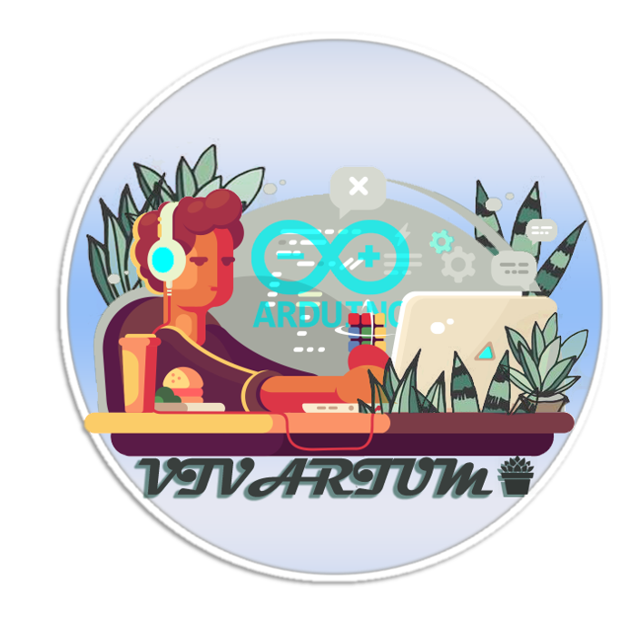
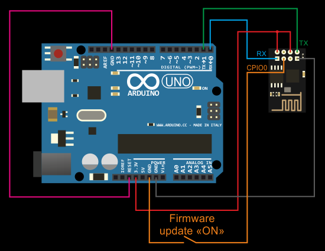
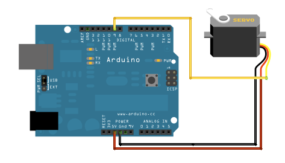
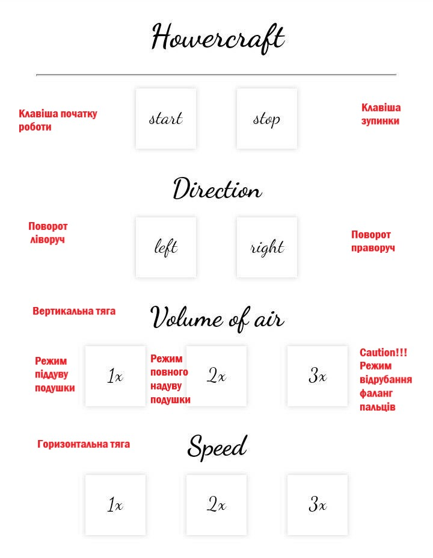

# Vivarium-Hovercraft

Рік випуску: 2018 
Версія: 1.0.0 
Розробник: Vivarium 
 

<h4>Апаратне забезпечення</h4>
<ul>
  <li>плата Arduino Uno (1)</li>
  <li>Мотор A2212 930 KV 3.17 мм (2)</li>
  <li>пропелер вертикальної тяги (1)</li>
  <li>пропелер горизонтальної тяги (1)</li>
  <li>Wi-Fi модуль ESP8266 (1)</li>
  <li>Аккумулятор ZIPPY Compact 1300 мАч 3S1P 25С (1)</li>
  <li>сервомотор (1)</li>
</ul>
<h4>Підключення компонентів</h4>
<ol>
  <li>Підключити ESP сервер до плати за схемою </li>
  <li>Підключити сервомотор та двигуни </li>
  <li>Підключити двигуни до батареї </li>
</ol>
<h4>Завантаження коду на плату Arduino Uno</h4>
Для завантаження коду на плату необхідно завантажити та встановити Arduino IDE 
Підключіть плату Arduino Uno до комп'ютера та загрузіть на нього код клієнтської частини 
Підключіть ESP модуль до комп'ютера та загрузіть на нього код серверної частини 
<h4>Інструкція з використання</h4>
Приєднайтеся до Wi-Fi ESP сервера на будь-якому приладі 
Відкрийте браузер та перейдіть за посиланням 192.168.4. 
Використовуйте сторінку для керування СПП 

